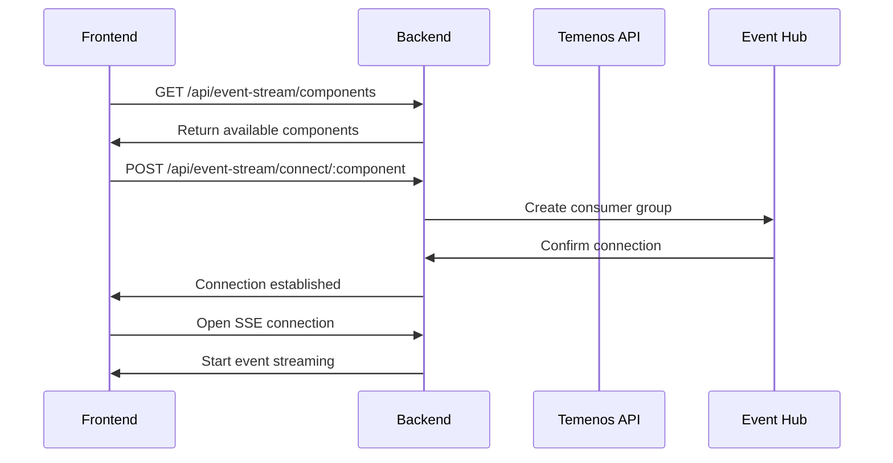
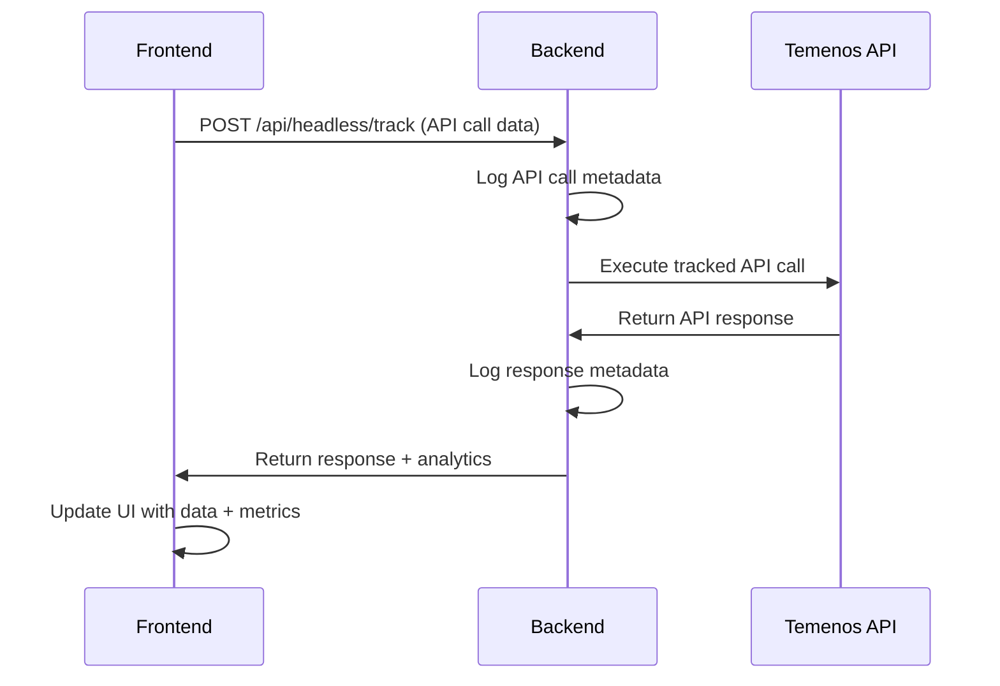
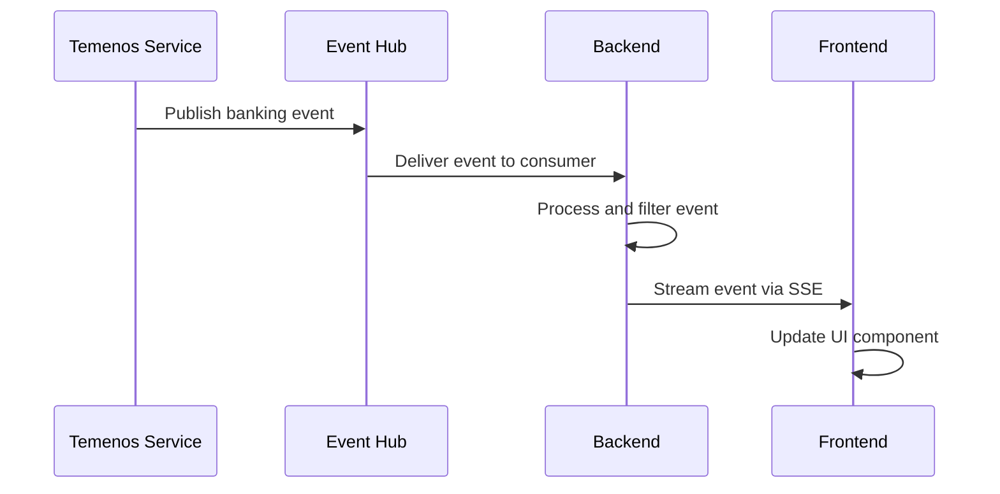

# Frontend-Backend Integration Guide

## Overview

The Modular Banking Demo implements a comprehensive integration pattern between a React frontend and Node.js backend, featuring real-time event streaming, RESTful API communication, and seamless banking service integration. This document details the integration architecture, communication patterns, and implementation strategies.

## Integration Architecture

### High-Level Architecture
```
┌─────────────────────┐    ┌─────────────────────┐    ┌─────────────────────┐
│   React Frontend    │    │   Node.js Backend   │    │  Temenos Banking    │
│   (Port 3000)      │◄──►│   (Port 5011)      │◄──►│    APIs             │
│                     │    │                     │    │                     │
│  ├─ Dashboard       │    │  ├─ Express Server  │    │  ├─ Party Service   │
│  ├─ Event Stream    │    │  ├─ Event Hub Svc   │    │  ├─ Deposits API    │
│  ├─ API Viewer      │    │  ├─ Session Mgr     │    │  ├─ Lending API     │
│  ├─ Mobile App      │    │  ├─ Banking Routes  │    │  └─ Holdings API    │
│  └─ Support Services│    │  └─ JOLT Service    │    │                     │
└─────────────────────┘    └─────────────────────┘    └─────────────────────┘
           │                          │                          │
           │                          │                          │
           │                ┌─────────▼─────────┐                │
           │                │  Azure Event Hub  │                │
           └────────────────┤   (Event Stream)  ├────────────────┘
                            └───────────────────┘
```

## Communication Patterns

### 1. RESTful API Communication

#### Frontend API Service Configuration
The frontend uses a centralized API configuration system:

```javascript
// src/config/apiConfig.js
const API_CONFIG = {
  baseUrl: process.env.REACT_APP_BACKEND_URL || 'http://localhost:5011',
  endpoints: {
    banking: '/api/banking',
    eventStream: '/api/event-stream',
    headless: '/api/headless',
    jolt: '/api/jolt',
    health: '/health'
  },
  components: {
    party: {
      name: 'Party/Customer Management',
      baseUrl: 'http://modulardemo.northeurope.cloudapp.azure.com/ms-party-api',
      endpoints: ['parties', 'customers', 'search']
    },
    deposits: {
      name: 'Deposits R25',
      baseUrl: 'http://deposits-sandbox.northeurope.cloudapp.azure.com',
      endpoints: ['accounts', 'transactions', 'balances']
    },
    lending: {
      name: 'Lending R24',
      baseUrl: 'http://lendings-sandbox.northeurope.cloudapp.azure.com',
      endpoints: ['loans', 'applications', 'schedules']
    },
    holdings: {
      name: 'Holdings/Arrangements',
      baseUrl: 'http://modulardemo.northeurope.cloudapp.azure.com/ms-holdings-api',
      endpoints: ['portfolios', 'arrangements', 'positions']
    }
  }
};
```

#### API Service Implementation
```javascript
// src/services/apiService.js
class ApiService {
  constructor() {
    this.baseUrl = API_CONFIG.baseUrl;
    this.sessionId = this.generateSessionId();
  }

  async makeRequest(endpoint, options = {}) {
    const url = `${this.baseUrl}${endpoint}`;
    const config = {
      method: 'GET',
      headers: {
        'Content-Type': 'application/json',
        'x-session-id': this.sessionId,
        ...options.headers
      },
      ...options
    };

    try {
      const response = await fetch(url, config);
      
      if (!response.ok) {
        throw new Error(`HTTP ${response.status}: ${response.statusText}`);
      }
      
      return await response.json();
    } catch (error) {
      console.error(`API request failed: ${url}`, error);
      throw error;
    }
  }

  // Banking API methods
  async getBankingData(endpoint, params = {}) {
    const queryString = new URLSearchParams(params).toString();
    const url = `/api/banking${endpoint}${queryString ? `?${queryString}` : ''}`;
    return this.makeRequest(url);
  }

  // Event Stream API methods
  async getEventStreamComponents() {
    return this.makeRequest('/api/event-stream/components');
  }

  async connectToComponent(componentKey, clientInfo) {
    return this.makeRequest(`/api/event-stream/connect/${componentKey}`, {
      method: 'POST',
      body: JSON.stringify(clientInfo)
    });
  }

  // Headless API methods
  async trackApiCall(trackingData) {
    return this.makeRequest('/api/headless/track', {
      method: 'POST',
      body: JSON.stringify(trackingData)
    });
  }
}
```

### 2. Server-Sent Events (SSE) Integration

#### Frontend Event Stream Implementation
```javascript
// EventStream component real-time integration
class EventStreamService {
  constructor(sessionId) {
    this.sessionId = sessionId;
    this.eventSources = new Map();
    this.reconnectAttempts = new Map();
  }

  connectToComponent(componentKey, onMessage, onError) {
    const url = `${API_CONFIG.baseUrl}/api/event-stream/events/${componentKey}?sessionId=${this.sessionId}`;
    
    const eventSource = new EventSource(url);
    
    eventSource.onmessage = (event) => {
      try {
        const data = JSON.parse(event.data);
        onMessage(data);
      } catch (error) {
        console.error('Failed to parse event data:', error);
      }
    };

    eventSource.onerror = (error) => {
      console.error('EventSource error:', error);
      
      if (eventSource.readyState === EventSource.CLOSED) {
        this.handleReconnection(componentKey, onMessage, onError);
      }
      
      onError && onError(error);
    };

    eventSource.onopen = () => {
      console.log(`Connected to ${componentKey} event stream`);
      this.reconnectAttempts.set(componentKey, 0);
    };

    this.eventSources.set(componentKey, eventSource);
    return eventSource;
  }

  handleReconnection(componentKey, onMessage, onError) {
    const attempts = this.reconnectAttempts.get(componentKey) || 0;
    const maxAttempts = 5;
    const delay = Math.min(1000 * Math.pow(2, attempts), 30000);

    if (attempts < maxAttempts) {
      setTimeout(() => {
        console.log(`Reconnecting to ${componentKey} (attempt ${attempts + 1})`);
        this.reconnectAttempts.set(componentKey, attempts + 1);
        this.connectToComponent(componentKey, onMessage, onError);
      }, delay);
    }
  }

  disconnect(componentKey) {
    const eventSource = this.eventSources.get(componentKey);
    if (eventSource) {
      eventSource.close();
      this.eventSources.delete(componentKey);
      this.reconnectAttempts.delete(componentKey);
    }
  }

  disconnectAll() {
    for (const [componentKey] of this.eventSources) {
      this.disconnect(componentKey);
    }
  }
}
```

#### Backend SSE Implementation
```javascript
// Backend event streaming setup
const setupEventStream = (req, res, componentKey) => {
  // Set SSE headers
  res.writeHead(200, {
    'Content-Type': 'text/event-stream',
    'Cache-Control': 'no-cache',
    'Connection': 'keep-alive',
    'Access-Control-Allow-Origin': '*',
    'Access-Control-Allow-Headers': 'Cache-Control'
  });

  const sessionId = req.query.sessionId || req.headers['x-session-id'];
  
  // Connect to Event Hub for this component
  eventHubService.connectToComponent(sessionId, componentKey, {
    userAgent: req.headers['user-agent'],
    ipAddress: req.ip
  }).then(() => {
    // Send initial connection confirmation
    res.write(`data: ${JSON.stringify({
      type: 'connected',
      componentKey,
      timestamp: new Date().toISOString()
    })}\n\n`);
  }).catch(error => {
    res.write(`data: ${JSON.stringify({
      type: 'error',
      message: 'Failed to connect to component',
      error: error.message
    })}\n\n`);
  });

  // Handle client disconnect
  req.on('close', () => {
    eventHubService.disconnectFromComponent(sessionId, componentKey);
  });

  // Keep connection alive
  const keepAlive = setInterval(() => {
    res.write(`data: ${JSON.stringify({
      type: 'ping',
      timestamp: new Date().toISOString()
    })}\n\n`);
  }, 30000);

  req.on('close', () => {
    clearInterval(keepAlive);
  });
};
```

### 3. Session Management Integration

#### Frontend Session Handling
```javascript
// Session management in React components
const useSession = () => {
  const [sessionId] = useState(() => {
    let session = sessionStorage.getItem('banking-session-id');
    if (!session) {
      session = `session-${Date.now()}-${Math.random().toString(36).substr(2, 9)}`;
      sessionStorage.setItem('banking-session-id', session);
    }
    return session;
  });

  const [sessionStatus, setSessionStatus] = useState('active');

  useEffect(() => {
    // Register session with backend
    const registerSession = async () => {
      try {
        const response = await fetch(`${API_CONFIG.baseUrl}/api/event-stream/session/register`, {
          method: 'POST',
          headers: {
            'Content-Type': 'application/json',
            'x-session-id': sessionId
          },
          body: JSON.stringify({
            userAgent: navigator.userAgent,
            timestamp: new Date().toISOString()
          })
        });

        if (response.ok) {
          setSessionStatus('registered');
        }
      } catch (error) {
        console.error('Failed to register session:', error);
        setSessionStatus('error');
      }
    };

    registerSession();

    // Cleanup on unmount
    return () => {
      fetch(`${API_CONFIG.baseUrl}/api/event-stream/session/${sessionId}/cleanup`, {
        method: 'DELETE',
        headers: { 'x-session-id': sessionId }
      }).catch(console.error);
    };
  }, [sessionId]);

  return { sessionId, sessionStatus };
};
```

#### Backend Session Management
```javascript
// Session management service
class SessionManager {
  constructor() {
    this.sessions = new Map();
    this.cleanupInterval = setInterval(() => {
      this.cleanupInactiveSessions();
    }, 60000); // Cleanup every minute
  }

  registerSession(sessionId, clientInfo) {
    const session = {
      sessionId,
      createdAt: Date.now(),
      lastActivity: Date.now(),
      userAgent: clientInfo.userAgent,
      ipAddress: clientInfo.ipAddress,
      isActive: true,
      connections: []
    };

    this.sessions.set(sessionId, session);
    console.log(`Session registered: ${sessionId}`);
    return session;
  }

  updateActivity(sessionId) {
    const session = this.sessions.get(sessionId);
    if (session) {
      session.lastActivity = Date.now();
    }
  }

  addConnection(sessionId, connectionInfo) {
    const session = this.sessions.get(sessionId);
    if (session) {
      session.connections.push({
        ...connectionInfo,
        connectedAt: Date.now()
      });
    }
  }

  removeConnection(sessionId, componentKey) {
    const session = this.sessions.get(sessionId);
    if (session) {
      session.connections = session.connections.filter(
        conn => conn.componentKey !== componentKey
      );
    }
  }

  cleanupSession(sessionId) {
    const session = this.sessions.get(sessionId);
    if (session) {
      // Close all connections
      session.connections.forEach(conn => {
        eventHubService.disconnectFromComponent(sessionId, conn.componentKey);
      });
      
      this.sessions.delete(sessionId);
      console.log(`Session cleaned up: ${sessionId}`);
    }
  }

  cleanupInactiveSessions() {
    const now = Date.now();
    const inactivityThreshold = 30 * 60 * 1000; // 30 minutes

    for (const [sessionId, session] of this.sessions) {
      if (now - session.lastActivity > inactivityThreshold) {
        this.cleanupSession(sessionId);
      }
    }
  }
}
```

## Data Flow Patterns

### 1. Component Loading and Initialization



### 2. API Call Tracking and Analytics



### 3. Real-time Event Processing



## Error Handling and Resilience

### Frontend Error Handling
```javascript
// Comprehensive error handling in frontend
class ApiErrorHandler {
  static handleApiError(error, context) {
    const errorInfo = {
      message: error.message,
      context,
      timestamp: new Date().toISOString(),
      userAgent: navigator.userAgent
    };

    switch (error.status) {
      case 404:
        console.warn('Resource not found:', errorInfo);
        return { 
          userMessage: 'The requested resource was not found.',
          shouldRetry: false 
        };
      
      case 500:
        console.error('Server error:', errorInfo);
        return { 
          userMessage: 'Banking service temporarily unavailable. Please try again.',
          shouldRetry: true 
        };
      
      case 401:
        console.error('Authentication error:', errorInfo);
        return { 
          userMessage: 'Authentication required. Please refresh and try again.',
          shouldRetry: false 
        };
      
      default:
        console.error('Unexpected error:', errorInfo);
        return { 
          userMessage: 'An unexpected error occurred. Please try again.',
          shouldRetry: true 
        };
    }
  }

  static async withRetry(apiCall, maxRetries = 3) {
    for (let attempt = 1; attempt <= maxRetries; attempt++) {
      try {
        return await apiCall();
      } catch (error) {
        const { shouldRetry } = this.handleApiError(error, `Attempt ${attempt}`);
        
        if (!shouldRetry || attempt === maxRetries) {
          throw error;
        }
        
        // Exponential backoff
        const delay = Math.min(1000 * Math.pow(2, attempt - 1), 10000);
        await new Promise(resolve => setTimeout(resolve, delay));
      }
    }
  }
}
```

### Backend Error Handling
```javascript
// Backend error handling middleware
const errorHandler = (err, req, res, next) => {
  const errorId = `error-${Date.now()}-${Math.random().toString(36).substr(2, 9)}`;
  
  console.error(`[${errorId}] ${err.message}`, {
    stack: err.stack,
    url: req.url,
    method: req.method,
    headers: req.headers,
    body: req.body,
    sessionId: req.headers['x-session-id']
  });

  // Determine error type and response
  let statusCode = 500;
  let message = 'Internal server error';

  if (err.name === 'ValidationError') {
    statusCode = 400;
    message = 'Invalid request data';
  } else if (err.name === 'AuthenticationError') {
    statusCode = 401;
    message = 'Authentication required';
  } else if (err.name === 'NotFoundError') {
    statusCode = 404;
    message = 'Resource not found';
  } else if (err.name === 'RateLimitError') {
    statusCode = 429;
    message = 'Too many requests';
  }

  res.status(statusCode).json({
    error: message,
    errorId,
    timestamp: new Date().toISOString(),
    ...(process.env.NODE_ENV === 'development' && { stack: err.stack })
  });
};

// Graceful shutdown handling
const gracefulShutdown = async (signal) => {
  console.log(`Received ${signal}. Starting graceful shutdown...`);
  
  // Stop accepting new connections
  server.close(() => {
    console.log('HTTP server closed');
  });

  try {
    // Cleanup services
    await eventHubService.shutdown();
    await sessionManager.cleanup();
    console.log('Services cleaned up successfully');
    
    process.exit(0);
  } catch (error) {
    console.error('Error during shutdown:', error);
    process.exit(1);
  }
};

process.on('SIGTERM', () => gracefulShutdown('SIGTERM'));
process.on('SIGINT', () => gracefulShutdown('SIGINT'));
```

## Security Integration

### Request Authentication and Headers
```javascript
// Frontend request authentication
const secureApiCall = async (endpoint, options = {}) => {
  const secureHeaders = {
    'Content-Type': 'application/json',
    'X-Requested-With': 'XMLHttpRequest',
    'x-session-id': sessionStorage.getItem('banking-session-id'),
    'x-client-type': 'banking-demo-frontend',
    'x-timestamp': new Date().toISOString(),
    ...options.headers
  };

  // Add CSRF token if available
  const csrfToken = document.querySelector('meta[name="csrf-token"]')?.getAttribute('content');
  if (csrfToken) {
    secureHeaders['x-csrf-token'] = csrfToken;
  }

  return fetch(endpoint, {
    ...options,
    headers: secureHeaders,
    credentials: 'include' // Include cookies for session management
  });
};
```

### Backend Security Middleware
```javascript
// Security middleware configuration
app.use(helmet({
  contentSecurityPolicy: {
    directives: {
      defaultSrc: ["'self'"],
      styleSrc: ["'self'", "'unsafe-inline'"],
      scriptSrc: ["'self'"],
      imgSrc: ["'self'", "data:", "https:"],
      connectSrc: ["'self'", "ws:", "wss:"]
    }
  },
  crossOriginEmbedderPolicy: false // Disabled for SSE compatibility
}));

// CORS configuration
app.use(cors({
  origin: (origin, callback) => {
    const allowedOrigins = process.env.ALLOWED_ORIGINS.split(',');
    if (!origin || allowedOrigins.includes(origin)) {
      callback(null, true);
    } else {
      callback(new Error('Not allowed by CORS'));
    }
  },
  credentials: true,
  methods: ['GET', 'POST', 'PUT', 'DELETE', 'OPTIONS'],
  allowedHeaders: [
    'Content-Type', 'Authorization', 'x-session-id', 
    'x-client-type', 'x-endpoint', 'x-solution', 'Accept',
    'x-csrf-token', 'x-timestamp'
  ]
}));

// Request validation middleware
const validateSession = (req, res, next) => {
  const sessionId = req.headers['x-session-id'];
  
  if (!sessionId) {
    return res.status(401).json({ error: 'Session ID required' });
  }

  const session = sessionManager.getSession(sessionId);
  if (!session || !session.isActive) {
    return res.status(401).json({ error: 'Invalid or expired session' });
  }

  sessionManager.updateActivity(sessionId);
  req.sessionId = sessionId;
  next();
};
```

## Performance Optimization

### Frontend Optimization Strategies
```javascript
// Connection pooling and caching
class OptimizedApiService {
  constructor() {
    this.cache = new Map();
    this.pendingRequests = new Map();
    this.cacheTimeout = 5 * 60 * 1000; // 5 minutes
  }

  async getCachedData(key, fetcher, options = {}) {
    const cached = this.cache.get(key);
    const now = Date.now();

    // Return cached data if still valid
    if (cached && (now - cached.timestamp) < this.cacheTimeout) {
      return cached.data;
    }

    // Deduplicate concurrent requests
    if (this.pendingRequests.has(key)) {
      return this.pendingRequests.get(key);
    }

    // Create new request
    const request = fetcher().then(data => {
      this.cache.set(key, { data, timestamp: now });
      this.pendingRequests.delete(key);
      return data;
    }).catch(error => {
      this.pendingRequests.delete(key);
      throw error;
    });

    this.pendingRequests.set(key, request);
    return request;
  }

  // Prefetch data for better UX
  async prefetchComponentData(componentKey) {
    const endpoints = API_CONFIG.components[componentKey]?.endpoints || [];
    
    const prefetchPromises = endpoints.map(endpoint => {
      const cacheKey = `${componentKey}-${endpoint}`;
      return this.getCachedData(cacheKey, () => 
        this.makeRequest(`/api/banking/${componentKey}/${endpoint}`)
      ).catch(error => {
        console.warn(`Prefetch failed for ${cacheKey}:`, error);
      });
    });

    await Promise.allSettled(prefetchPromises);
  }
}
```

### Backend Performance Optimization
```javascript
// Connection pooling and caching
const NodeCache = require('node-cache');
const responseCache = new NodeCache({ stdTTL: 300 }); // 5 minute TTL

// Response caching middleware
const cacheMiddleware = (duration = 300) => (req, res, next) => {
  const key = `${req.method}:${req.originalUrl}`;
  const cached = responseCache.get(key);

  if (cached) {
    res.set('X-Cache', 'HIT');
    return res.json(cached);
  }

  res.set('X-Cache', 'MISS');
  
  // Override res.json to cache the response
  const originalJson = res.json;
  res.json = function(body) {
    if (res.statusCode === 200) {
      responseCache.set(key, body, duration);
    }
    return originalJson.call(this, body);
  };

  next();
};

// HTTP connection pooling
const https = require('https');
const http = require('http');

const httpAgent = new http.Agent({
  keepAlive: true,
  maxSockets: 50,
  maxFreeSockets: 10,
  timeout: 60000
});

const httpsAgent = new https.Agent({
  keepAlive: true,
  maxSockets: 50,
  maxFreeSockets: 10,
  timeout: 60000
});

// Use agents in axios configuration
const axiosInstance = axios.create({
  httpAgent,
  httpsAgent,
  timeout: 30000
});
```

## Monitoring and Observability

### Integration Monitoring
```javascript
// Frontend performance monitoring
class IntegrationMonitor {
  constructor() {
    this.metrics = {
      apiCalls: new Map(),
      eventStreams: new Map(),
      errors: [],
      performance: []
    };
  }

  trackApiCall(endpoint, duration, status) {
    const key = `${endpoint}:${status}`;
    const current = this.metrics.apiCalls.get(key) || { count: 0, totalDuration: 0 };
    
    this.metrics.apiCalls.set(key, {
      count: current.count + 1,
      totalDuration: current.totalDuration + duration,
      averageDuration: (current.totalDuration + duration) / (current.count + 1),
      lastCall: Date.now()
    });
  }

  trackEventStream(componentKey, eventType) {
    const key = `${componentKey}:${eventType}`;
    const current = this.metrics.eventStreams.get(key) || 0;
    this.metrics.eventStreams.set(key, current + 1);
  }

  getHealthStatus() {
    const now = Date.now();
    const recentErrors = this.metrics.errors.filter(
      error => now - error.timestamp < 300000 // Last 5 minutes
    );

    return {
      status: recentErrors.length < 10 ? 'healthy' : 'degraded',
      apiCalls: Object.fromEntries(this.metrics.apiCalls),
      eventStreams: Object.fromEntries(this.metrics.eventStreams),
      recentErrors: recentErrors.length,
      timestamp: new Date().toISOString()
    };
  }
}

// Backend monitoring
const collectMetrics = () => {
  return {
    memory: process.memoryUsage(),
    uptime: process.uptime(),
    sessions: {
      active: sessionManager.getActiveSessions().length,
      total: sessionManager.getTotalSessions()
    },
    eventHub: {
      connections: eventHubService.getActiveConnections(),
      eventsProcessed: eventHubService.getEventsProcessed()
    },
    api: {
      requestsPerMinute: getRequestsPerMinute(),
      averageResponseTime: getAverageResponseTime(),
      errorRate: getErrorRate()
    }
  };
};

// Health check endpoint
app.get('/health', (req, res) => {
  const metrics = collectMetrics();
  const status = {
    status: 'healthy',
    timestamp: new Date().toISOString(),
    services: {
      server: 'active',
      eventHub: eventHubService.isHealthy() ? 'active' : 'inactive',
      sessionManager: 'active',
      banking: 'active'
    },
    metrics
  };

  res.json(status);
});
```

## Testing Integration

### End-to-End Integration Tests
```javascript
// Frontend integration tests
describe('Frontend-Backend Integration', () => {
  let apiService;

  beforeEach(() => {
    apiService = new ApiService();
  });

  test('should establish event stream connection', async () => {
    const componentKey = 'party';
    const events = [];
    
    const eventSource = await apiService.connectToEventStream(
      componentKey,
      (event) => events.push(event)
    );

    // Wait for connection
    await new Promise(resolve => {
      eventSource.onopen = resolve;
    });

    expect(eventSource.readyState).toBe(EventSource.OPEN);
    
    // Cleanup
    eventSource.close();
  });

  test('should handle API call tracking', async () => {
    const trackingData = {
      uri: '/api/banking/parties/123',
      method: 'GET',
      domain: 'Party',
      endpoint: 'getParty'
    };

    const response = await apiService.trackApiCall(trackingData);
    
    expect(response).toHaveProperty('requestId');
    expect(response).toHaveProperty('timestamp');
  });
});

// Backend integration tests
describe('Backend Integration', () => {
  test('should handle session lifecycle', async () => {
    const sessionId = 'test-session-123';
    
    // Register session
    const session = sessionManager.registerSession(sessionId, {
      userAgent: 'test-agent',
      ipAddress: '127.0.0.1'
    });

    expect(session.sessionId).toBe(sessionId);
    expect(session.isActive).toBe(true);

    // Connect to component
    await eventHubService.connectToComponent(sessionId, 'party', {});
    
    // Verify connection
    const stats = eventHubService.getStats();
    expect(stats.activeConnections).toBeGreaterThan(0);

    // Cleanup
    await sessionManager.cleanupSession(sessionId);
    
    const finalStats = eventHubService.getStats();
    expect(finalStats.activeConnections).toBe(0);
  });
});
```

## Deployment Integration

### Environment Configuration
```yaml
# docker-compose.yml - Integration setup
version: '3.8'
services:
  backend:
    build: ./demoflow-backend
    ports:
      - "5011:5011"
    environment:
      - NODE_ENV=production
      - PORT=5011
      - ALLOWED_ORIGINS=http://localhost:3000
    depends_on:
      - redis
      - kafka

  frontend:
    build: ./modular-banking-frontend
    ports:
      - "3000:3000"
    environment:
      - REACT_APP_BACKEND_URL=http://backend:5011
    depends_on:
      - backend

  redis:
    image: redis:alpine
    ports:
      - "6379:6379"

  kafka:
    image: confluentinc/cp-kafka:latest
    environment:
      KAFKA_ZOOKEEPER_CONNECT: zookeeper:2181
      KAFKA_ADVERTISED_LISTENERS: PLAINTEXT://kafka:9092
```

This integration guide provides comprehensive coverage of how the frontend and backend systems work together, ensuring reliable, secure, and performant communication between all components of the Modular Banking Demo application. 